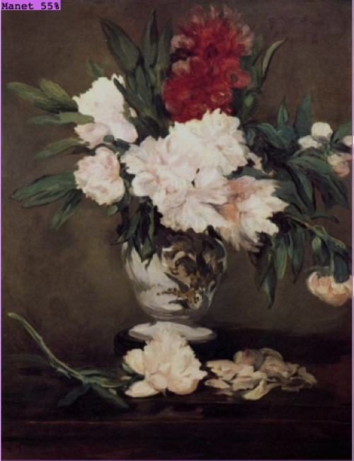
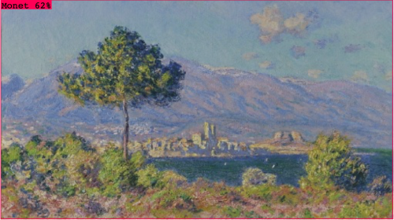

# Monet vs Manet
Классификация картин для выявления их автора
## Создание датасета
* ##### Отбор картин 
Для данной задачи были отобраны одинаково, наиболее популярные и менее известные работы художников. 
В итоге получилось по 54% и 46% картин Моне и Мане соответственно
* ##### Roboflow
Для создания кастомного датасета использовался Roboflow
1. Разметка данных
2. Препроцессинг 

   * Auto-Orient
   * Resize
3. Аугментация 

    * Flip
    * Brightness ±20% 
## Обучение в Roboflow
* ##### Обучение

* ##### Результаты

## Обучение YOLOv5
Для обучения использовалась nano модель YOLO
* ##### Результаты обучения на 30 эпохах
Предсказания на 2 Моне, 1 Мане 
.png) .png) .png)
* ##### Результаты обучения на 50 эпохах
2 Monet
.png) .png)
## Предсказания модели
* ##### Результаты
Похоже, что, переобучение :(

